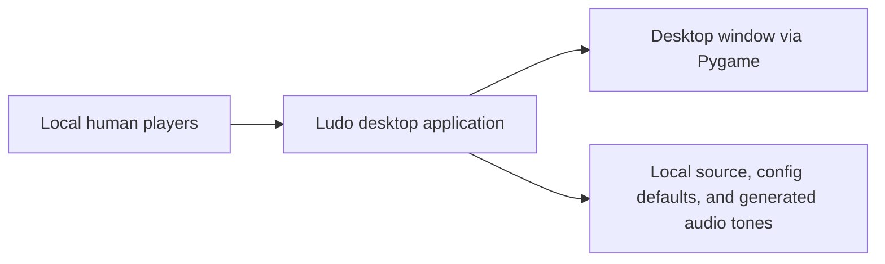
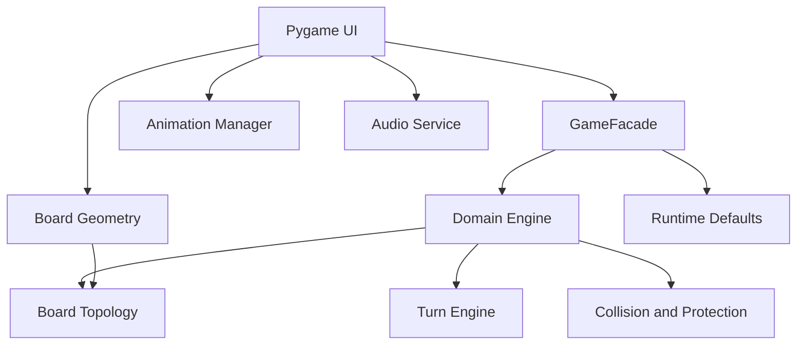
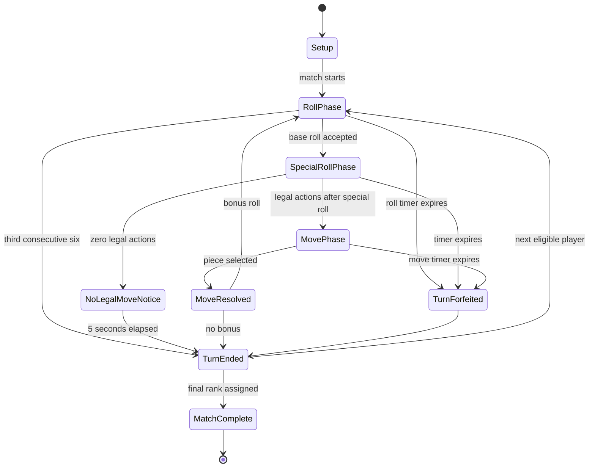
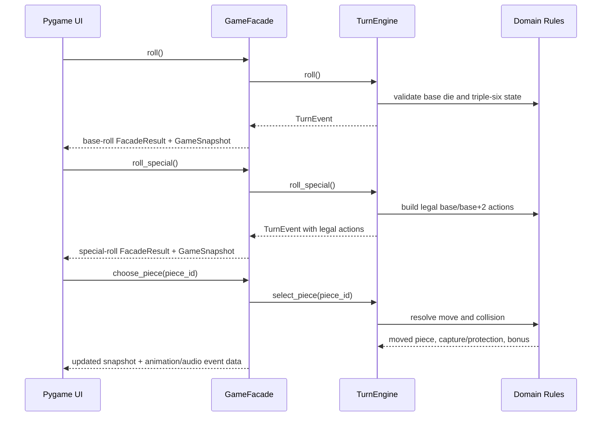

# Architecture and Implementation Plan

This document describes the current implemented architecture and preserves the rationale behind its
main boundaries. Product requirements are in [PRD.md](PRD.md), authoritative rules are in
[PRD_GAME_RULES.md](PRD_GAME_RULES.md), implemented UX behavior is in [UX_DESIGN.md](UX_DESIGN.md),
and remaining release/documentation tasks are tracked in [TODO.md](TODO.md).

## Architectural Goals

- Keep authoritative game rules independent from Pygame.
- Keep logical board positions independent from screen coordinates.
- Make the core engine deterministic and testable.
- Route GUI and future controllers through an application/SDK facade.
- Keep architecture proportional to a local desktop game.
- Leave a realistic extension point for future non-UI controllers without implementing them now.

## Implemented Package Structure

```text
src/
└── ludo/
    ├── __init__.py
    ├── app/
    │   ├── __init__.py
    │   └── facade.py
    ├── audio/
    │   ├── __init__.py
    │   └── service.py
    ├── config/
    │   ├── __init__.py
    │   └── defaults.py
    ├── domain/
    │   ├── __init__.py
    │   ├── board.py
    │   ├── bonus_die.py
    │   ├── colors.py
    │   ├── hazards.py
    │   ├── match.py
    │   ├── movement.py
    │   ├── occupancy.py
    │   ├── pieces.py
    │   ├── players.py
    │   └── turns.py
    ├── geometry/
    │   ├── __init__.py
    │   ├── board_geometry.py
    │   └── grid.py
    └── pygame_ui/
        ├── __init__.py
        ├── animation.py
        ├── board_renderer.py
        ├── controls.py
        ├── gameplay_renderer.py
        ├── interaction.py
        ├── layout.py
        ├── main.py
        ├── render_models.py
        ├── render_state.py
        ├── screens.py
        ├── state.py
        └── theme.py
```

Tests are organized as:

```text
tests/
├── integration/
└── unit/
```

## Responsibility Boundaries

- **Domain/game logic**: colors, players, pieces, board topology, movement, capture, protected
  occupancy, special-square effects, bonus rolls, Triple Six, turn rotation, timers, ranking, and
  match completion.
- **Board topology**: 1D logical outer path, color starts, Home Paths, safe-square identities, and
  Finished as a separate destination.
- **Application/SDK facade**: public boundary used by Pygame and future controllers.
- **Board geometry**: maps logical positions to screen coordinates and performs hit testing for UI.
- **Pygame UI**: screens, rendering, input dispatch, animation, audio triggering, and presentation
  state.
- **Interaction**: translates mouse hover/clicks into facade commands or visual previews.
- **Animation**: visualizes resolved facade route/event data without deciding rules.
- **Audio**: generated sound cues and no-op fallback.
- **Configuration**: animation and audio tuning defaults.

Dependency direction:

```text
pygame_ui -> app -> domain
pygame_ui -> geometry
geometry -> domain board identifiers
audio -> app result types
domain -> no pygame dependency
```

## C4-Style Context



No network service, database, authentication provider, external API, or paid service is part of the
current baseline.

## Container View



## Application/SDK Facade

`GameFacade` is the public entry point for UI and future controllers. It exposes:

- start match;
- pause and resume for UI-created matches;
- immutable/read-only snapshots;
- current player and phase queries;
- seconds remaining;
- dice rolling;
- legal moves;
- piece selection;
- no-legal notice completion;
- timeout expiration;
- player and piece state lookup;
- rankings and match-complete state.

Facade snapshots include players, inactive colors, current player, turn phase, timer state, current
dice value, legal moves, outer occupancies, Hazard/Boost/Shield-square positions, rankings, and
completion status.

Facade command results include structured events such as dice rolled, no legal move, piece moved,
triple-six cancellation, turn passed, roll timeout, and move timeout. Results also expose capture,
finish, bonus, Hazard, Boost, Shield acquired, Shield broken, ranking, turn-change, and
match-completion information.

## Game State And State Machine

Important implemented phases:



Pause overlays active gameplay, freezes the UI-created clock, suspends input, and pauses animations.

## Turn Engine

The Turn Engine:

- maintains clockwise eligible-player rotation;
- skips inactive colors by only including active players;
- skips ranked players after completion;
- tracks roll and move phases;
- tracks the explicit normal-die and Special Die phases;
- tracks consecutive sixes;
- tracks forced base-six anti-stall markers for players trapped in Yard;
- emits public event information consumed by the facade;
- handles roll and move timeouts;
- handles no-legal move notice completion.

Ranking and automatic final-rank assignment are owned by `Match` and integrated after move
resolution.

## Board Topology Representation

The authoritative topology is a logical 1D model:

- global outer positions `0..51`;
- start positions Red 0, Green 13, Yellow 26, Blue 39;
- eight safe positions: four starts and four star squares;
- color-specific Home Path positions `0..4`;
- separate Finished state.

Movement is represented in steps relative to a piece's color start, not by screen pixels.

`OUTER_GRID_PATH` maps the 52 logical outer positions to a 15x15 board grid for rendering. Four
corner transitions are intentional diagonal single logical steps so the 52-square path remains
continuous on the classic board shape.

## Rules And Legal Moves

Implemented domain services determine:

- which pieces can move for a dice result;
- Yard exit legality;
- outer path progression;
- Home Path entry;
- exact finish;
- overshoot prevention;
- capture eligibility;
- protected-block behavior;
- Hazard, Boost, Shield, and Backward Capture behavior;
- bonus roll eligibility;
- Triple Six cancellation;
- ranking and match completion.

Pygame displays legal choices from facade snapshots and does not recalculate movement legality.

## Sequence Flow



## Randomness And Time

Randomness and time are injectable:

- dice rolls use a `Dice` protocol with fixed and random implementations;
- Special Die rolls use a separate injectable provider with fixed and random implementations;
- color assignment uses `ColorRandomizer` with fixed and random implementations;
- special-square layout generation uses injectable randomness;
- timers use a `Clock` protocol;
- UI-created facade matches use `PausableClock`;
- tests supply deterministic providers.

## Configuration

Implemented configuration currently covers:

- movement animation duration per route step;
- capture feedback and return durations;
- finish pulse duration;
- dice animation duration;
- no-legal notice duration;
- transient feedback duration;
- audio enablement and volumes.

Fundamental game-rule invariants such as outer path length 52, Home Path length 5, and safe-square
count 8 remain constants in domain/geometry code rather than user configuration.

Package metadata stores version `1.0`, the normalized PEP 440 representation of the documented
application version `1.00`.

## Error Handling

- Invalid facade commands raise `GameFacadeError`.
- Invalid domain operations fail fast with clear `ValueError`-style errors.
- UI actions that are invalid for the current phase are ignored or rejected without mutating state.
- User-facing messages are concise and non-technical.

## Future Controller Extension

Non-UI controllers are not implemented. The architecture preserves this future direction:

```text
Human Controller -> GameFacade
Other Controller -> GameFacade
```

A future controller can inspect snapshots and legal moves, then choose among legal actions without
direct access to mutable domain internals.

## Testing Strategy

The current test suite includes unit and integration coverage for:

- domain models and invariants;
- board topology and grid geometry;
- movement and legal moves;
- capture/protection occupancy rules;
- turn phases, dice, timers, bonuses, Triple Six, and no-legal flow;
- match setup, color assignment, ranking, and completion;
- facade workflows and public snapshots;
- render-state preparation;
- interaction controller behavior;
- screen-flow state;
- animation state;
- audio event mapping.

Tests use deterministic clocks, dice, and color randomizers. Rendering tests avoid brittle
screenshot comparisons.

## Linting And Code Quality

Ruff is configured in `pyproject.toml` with:

```toml
line-length = 100
```

Current baseline verification:

- `uv run pytest`: 1553 tests passed.
- `uv run pytest --cov`: 86.63% coverage, above the configured 85% threshold.
- `uv run ruff check .`: passing.

## Not Applicable For Current Baseline

The project has no external API, network service, database, authentication, token usage, or paid
service dependency. The architecture intentionally does not include API gateways, rate-limit queues,
secret-management systems beyond normal repository hygiene, REST APIs, microservices, or database
abstractions.

## Architecture Decision Records

### ADR 1: 1D Logical Board Topology

- **Decision**: Use a one-dimensional 52-position outer path as the authoritative board topology.
- **Context**: All active pieces traverse the same circular path relative to their color start.
- **Alternatives considered**: A 2D matrix, screen-coordinate positions, or hand-coded coordinate
  logic.
- **Rationale**: A 1D path directly models movement, simplifies legal-move testing, and avoids
  coupling domain state to rendering.
- **Trade-offs/consequences**: Rendering needs a separate mapping layer, but domain logic remains
  simpler and deterministic.

### ADR 2: Separate Logical Positions From Screen Coordinates

- **Decision**: Store game state as logical positions and map them to screen coordinates only in the
  geometry/rendering layer.
- **Context**: Pygame needs pixel positions, but rules do not.
- **Alternatives considered**: Store pixel positions on pieces or infer rules from board geometry.
- **Rationale**: Logical state stays testable and independent from presentation.
- **Trade-offs/consequences**: The geometry mapper must be kept accurate, but it has no authority
  over rules.

### ADR 3: Domain Engine Independent From Pygame

- **Decision**: The domain engine must not import or depend on Pygame.
- **Context**: Rules should be testable without opening a desktop window.
- **Alternatives considered**: Implement rules inside Pygame event handlers.
- **Rationale**: Separation improves testability, maintainability, and future controller support.
- **Trade-offs/consequences**: The UI translates domain/facade events into presentation behavior.

### ADR 4: Application/SDK Facade As GUI Boundary

- **Decision**: Pygame interacts with game logic through an application/SDK facade.
- **Context**: Without a boundary, GUI code can accumulate duplicated rule decisions.
- **Alternatives considered**: Direct UI access to domain objects.
- **Rationale**: The facade provides a stable contract for GUI, tests, and future Bot controllers.
- **Trade-offs/consequences**: The facade must stay coherent rather than becoming an unstructured
  pass-through.

### ADR 5: Dependency-Injected Randomness And Time

- **Decision**: Dice, color assignment, and timers use injectable providers or equivalent
  abstractions.
- **Context**: Tests need deterministic results for random and time-based behavior.
- **Alternatives considered**: Direct calls to random/time APIs throughout the code.
- **Rationale**: Controlled providers make rule interactions, timeouts, and color assignment
  testable.
- **Trade-offs/consequences**: Slightly more setup is needed, but tests are reliable.

### ADR 6: Human-vs-Human Baseline With Future Controller Extension

- **Decision**: Implement Human vs Human while designing the facade so future controllers can use
  the same legal-action API.
- **Context**: Non-UI controllers are out of scope, but future support should not require a
  redesign.
- **Alternatives considered**: Build additional controller logic now or ignore future controller
  needs entirely.
- **Rationale**: A shared action boundary supports extension without speculative AI implementation.
- **Trade-offs/consequences**: The API exposes enough state for a future Bot while staying focused on
  current gameplay.

### ADR 7: Dynamic Mixed-Player Block As Intentional Domain Rule

- **Decision**: Treat the custom protected-block system, including legally evolved mixed-player
  blocks, as a first-class domain rule.
- **Context**: This differs from many traditional Ludo variants and has important edge cases.
- **Alternatives considered**: Use traditional blocking/capture rules or treat coexistence as a UI
  artifact.
- **Rationale**: The rule is strategic and must be enforced consistently by the engine.
- **Trade-offs/consequences**: Legal-move and capture logic need explicit occupancy-history
  semantics so mixed coexistence cannot be created by declining a vulnerable capture.
