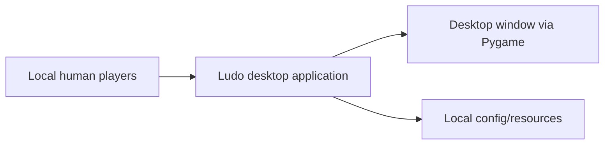
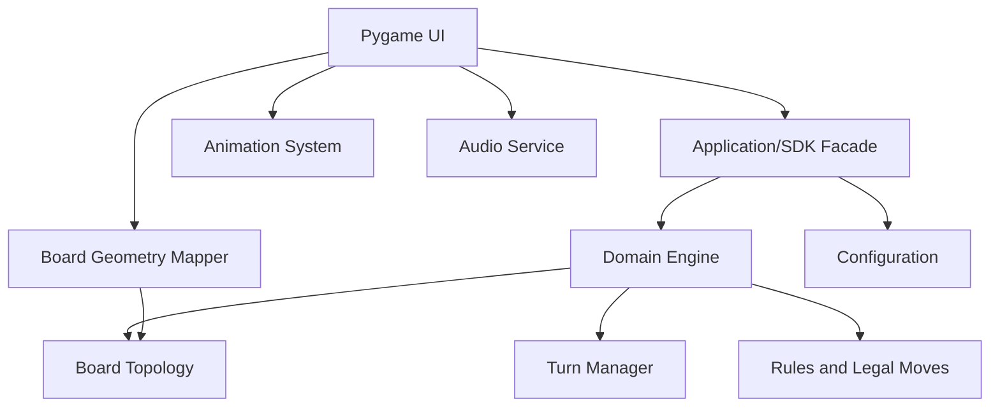
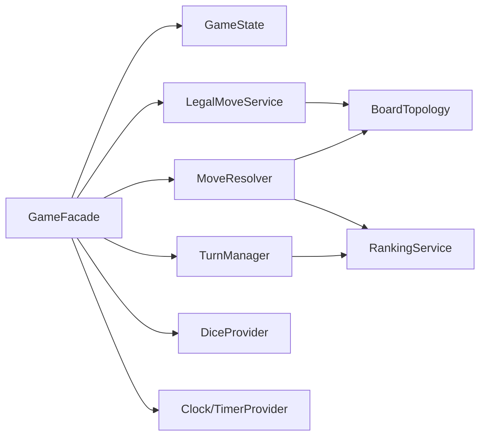
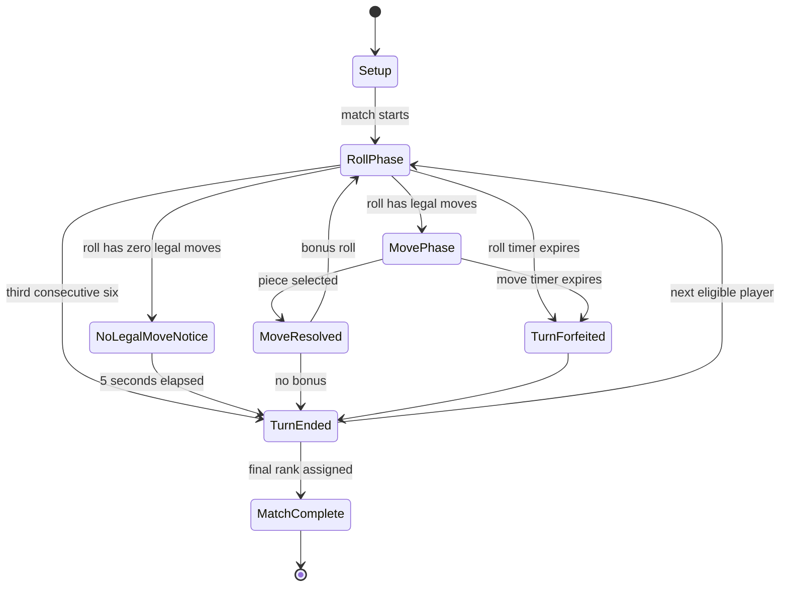
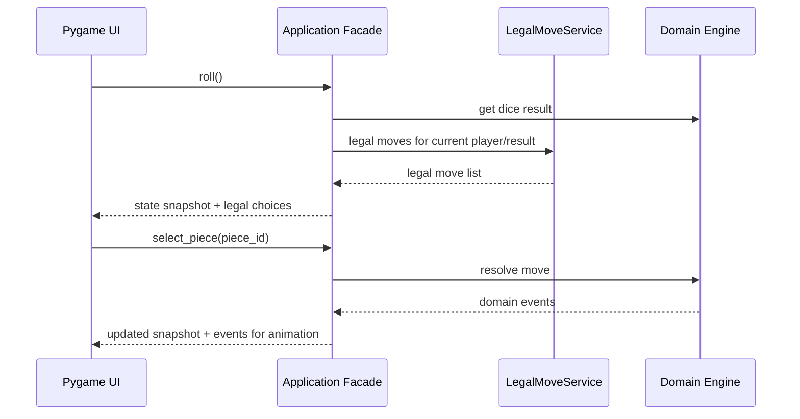

# Architecture and Implementation Plan

This document plans architecture only. It does not implement source code. Product requirements are
in [PRD.md](PRD.md), authoritative rules are in [PRD_GAME_RULES.md](PRD_GAME_RULES.md), UX direction
is in [UX_DESIGN.md](UX_DESIGN.md), and the implementation roadmap is in [TODO.md](TODO.md).

## Architectural Goals

- Keep authoritative game rules independent from Pygame.
- Keep logical board positions independent from screen coordinates.
- Make the core engine deterministic and testable.
- Route GUI and future controllers through an application/SDK facade.
- Keep architecture proportional to a local desktop game.
- Leave a realistic extension point for future Bot controllers.

## Proposed Package Structure

Future structure, not yet created:

```text
src/
└── ludo/
    ├── __init__.py
    ├── app/
    │   ├── facade.py
    │   ├── commands.py
    │   └── snapshots.py
    ├── domain/
    │   ├── board.py
    │   ├── colors.py
    │   ├── dice.py
    │   ├── moves.py
    │   ├── pieces.py
    │   ├── rules.py
    │   ├── state.py
    │   └── turns.py
    ├── config/
    │   ├── defaults.py
    │   └── schema.py
    ├── geometry/
    │   └── board_geometry.py
    ├── pygame_ui/
    │   ├── main.py
    │   ├── screens.py
    │   ├── input.py
    │   ├── rendering.py
    │   └── animation.py
    ├── audio/
    │   └── service.py
    └── resources/
```

Planned tests:

```text
tests/
├── unit/
└── integration/
```

## Responsibility Boundaries

- **Domain/game logic**: rules, pieces, movement, capture, block protection, bonus rolls, triple-six
  tracking, turn rotation, ranking, and invariant enforcement.
- **Board topology**: 1D logical outer path, color starts, home paths, safe-square identities.
- **Application/SDK facade**: public boundary used by GUI and future controllers.
- **Board geometry**: maps logical positions to screen coordinates for rendering only.
- **Pygame UI**: screens, rendering, input, animations, and presentation state.
- **Input**: translates mouse/keyboard events into application commands.
- **Animation**: visualizes resolved domain events without deciding rules.
- **Audio**: optional sound effects and volume configuration.
- **Configuration**: versioned tunable values such as timers, animation timings, display settings,
  and audio volumes.

Dependency direction:

```text
pygame_ui -> app -> domain
pygame_ui -> geometry
geometry -> domain board identifiers
domain -> no pygame dependency
```

## C4-Style Context



No network service, database, authentication provider, or external API is part of V1.

## Container View



## Component View



Names are provisional and may change during implementation if a clearer design emerges.

## Application/SDK Facade

The facade is the single public entry point for GUI and future controllers. It should expose
operations conceptually like:

- start match;
- query immutable or read-only game snapshots;
- query current player and phase;
- roll dice;
- query legal moves;
- select/move piece;
- query rankings;
- pause/resume application state where appropriate.

The final API should be designed during implementation, but the boundary requirement is fixed: GUI
code must not bypass the facade to reproduce business logic.

## Game State and State Machine

Important phases:



Pause overlays the active gameplay phase and preserves remaining timer/animation state.

## Turn Manager

The Turn Manager should:

- maintain clockwise eligible-player rotation;
- skip inactive colors;
- skip ranked players;
- reset or preserve consecutive-six state according to the rules;
- assign the final remaining rank automatically when one unranked player remains.

## Board Topology Representation

The authoritative topology should be a logical 1D model:

- global outer positions `0..51`;
- color-specific start positions;
- color-specific Home Path positions `0..4`;
- separate Finished state;
- safe-square identity set of exactly 8 outer positions.

Movement should be represented in steps relative to a piece's color start, not by screen pixels.

## Rules and Legal Moves

A dedicated rules/legal-move service should determine:

- which pieces can move for a dice result;
- Yard exit legality;
- outer path progression;
- Home Path entry;
- exact finish;
- overshoot prevention;
- capture eligibility;
- protected block handling;
- whether a move result creates a bonus.

Pygame must display legal choices from this service rather than recalculating them.

## Sequence Flow



## Randomness and Time

Randomness and time must be injectable or controllable:

- dice rolls should use a provider interface or equivalent abstraction;
- color assignment should use controlled randomness;
- timers should use a clock/timer abstraction;
- tests should supply deterministic providers.

## Configuration

Use versioned configuration for tunable application values:

- roll decision timeout: 10 seconds;
- move decision timeout: 10 seconds;
- no-legal-move notification: 5 seconds;
- animation timings;
- display/window settings;
- audio volumes.

Fundamental game-rule invariants such as outer path length 52, Home Path length 5, and safe-square
count 8 may remain strongly typed constants/enums rather than user configuration.

Planned application version: `1.00`. The future package should have a single authoritative version
location, likely package metadata, with runtime display reading from that source rather than
duplicating strings. Configuration schema versions should be tracked separately when introduced.

## Error Handling and Logging

- Invalid commands should fail with clear application-level errors or result objects.
- Domain invariants should fail fast during development.
- User-facing messages should be concise and non-technical.
- Logging should support debugging during development without exposing unnecessary complexity.

## Future Bot Extension

Bots are out of scope for V1. The architecture should allow:

```text
Human Controller -> Application/Game API
Bot Controller   -> same Application/Game API
```

A future Bot should receive snapshots and legal moves, then choose among legal actions. It must not
modify internal game objects directly. No AI APIs or external services are planned.

## Testing Strategy

- Follow RED -> GREEN -> REFACTOR.
- Unit tests cover domain services, topology, move legality, move resolution, turns, timers,
  ranking, randomness providers, and configuration validation.
- Integration tests cover facade-level workflows.
- Public game/domain operations require tests.
- Tests cover normal behavior, invalid input, boundary conditions, rule interactions, and
  deterministic timer/state transitions.
- Tests must not depend on external services.

Critical scenarios are listed in [PRD_GAME_RULES.md](PRD_GAME_RULES.md#acceptance-and-test-scenarios).

## Linting and Code Quality

Plan Ruff with:

```toml
line-length = 100
```

Appropriate modern categories should be selected during tool setup. Suppressions should not be
added merely to pass lint without documented justification.

Code quality expectations:

- descriptive naming;
- Single Responsibility Principle;
- DRY where it reduces real maintenance cost;
- composition over unnecessary inheritance;
- abstractions only when they solve a real problem;
- detailed docstrings;
- comments explaining why and non-obvious assumptions.

## Not Applicable for V1

The project has no external API, network service, database, authentication, token usage, or paid
service dependency. Therefore the architecture should not include API gateways, rate-limit queues,
secret-management systems beyond normal repository hygiene, REST APIs, microservices, or database
abstractions.

## Architecture Decision Records

### ADR 1: 1D Logical Board Topology

- **Decision**: Use a one-dimensional 52-position outer path as the authoritative board topology.
- **Context**: All active pieces traverse the same circular path relative to their color start.
- **Alternatives considered**: A 2D matrix, screen-coordinate positions, or hand-coded coordinate
  logic.
- **Rationale**: A 1D path directly models movement, simplifies legal-move testing, and avoids
  coupling domain state to rendering.
- **Trade-offs/consequences**: Rendering needs a separate mapping layer, but domain logic becomes
  simpler and more deterministic.

### ADR 2: Separate Logical Positions from Screen Coordinates

- **Decision**: Store game state as logical positions and map them to screen coordinates only in the
  geometry/rendering layer.
- **Context**: Pygame needs pixel positions, but rules do not.
- **Alternatives considered**: Store pixel positions on pieces or infer rules from board geometry.
- **Rationale**: Logical state stays testable and independent from presentation.
- **Trade-offs/consequences**: The geometry mapper must be kept accurate, but it has no authority
  over rules.

### ADR 3: Domain Engine Independent from Pygame

- **Decision**: The domain engine must not import or depend on Pygame.
- **Context**: Rules should be testable without opening a desktop window.
- **Alternatives considered**: Implement rules inside Pygame event handlers.
- **Rationale**: Separation improves testability, maintainability, and future controller support.
- **Trade-offs/consequences**: The UI must translate domain events into presentation behavior.

### ADR 4: Application/SDK Facade as GUI Boundary

- **Decision**: Pygame interacts with game logic through an application/SDK facade.
- **Context**: Without a boundary, GUI code can accumulate duplicated rule decisions.
- **Alternatives considered**: Direct UI access to domain objects.
- **Rationale**: The facade provides a stable contract for GUI, tests, and future Bot controllers.
- **Trade-offs/consequences**: The facade must be designed carefully to avoid becoming an unstructured
  pass-through.

### ADR 5: Dependency-Injected Randomness and Time

- **Decision**: Dice, color assignment, and timers should use injectable providers or equivalent
  abstractions.
- **Context**: Tests need deterministic results for random and time-based behavior.
- **Alternatives considered**: Direct calls to random/time APIs throughout the code.
- **Rationale**: Controlled providers make rule interactions, timeouts, and color assignment
  testable.
- **Trade-offs/consequences**: Slightly more setup is needed, but tests become reliable.

### ADR 6: Human-vs-Human V1 with Future Controller Extension

- **Decision**: Implement only Human vs Human in V1 while designing the facade so future Bots can use
  the same legal-action API.
- **Context**: Bots are explicitly out of scope, but future support should not require a redesign.
- **Alternatives considered**: Build Bot logic now or ignore future controller needs entirely.
- **Rationale**: A shared action boundary supports extension without speculative AI implementation.
- **Trade-offs/consequences**: The API must expose enough state for a future Bot while staying focused
  on current gameplay.

### ADR 7: Dynamic Mixed-Player Block as Intentional Domain Rule

- **Decision**: Treat the custom protected-block system, including legally evolved mixed-player
  blocks, as a first-class domain rule.
- **Context**: This differs from many traditional Ludo variants and has important edge cases.
- **Alternatives considered**: Use traditional blocking/capture rules or treat coexistence as a UI
  artifact.
- **Rationale**: The rule is strategic and must be enforced consistently by the engine.
- **Trade-offs/consequences**: Legal-move and capture logic need explicit occupancy-history semantics
  so mixed coexistence cannot be created by declining a vulnerable capture.
